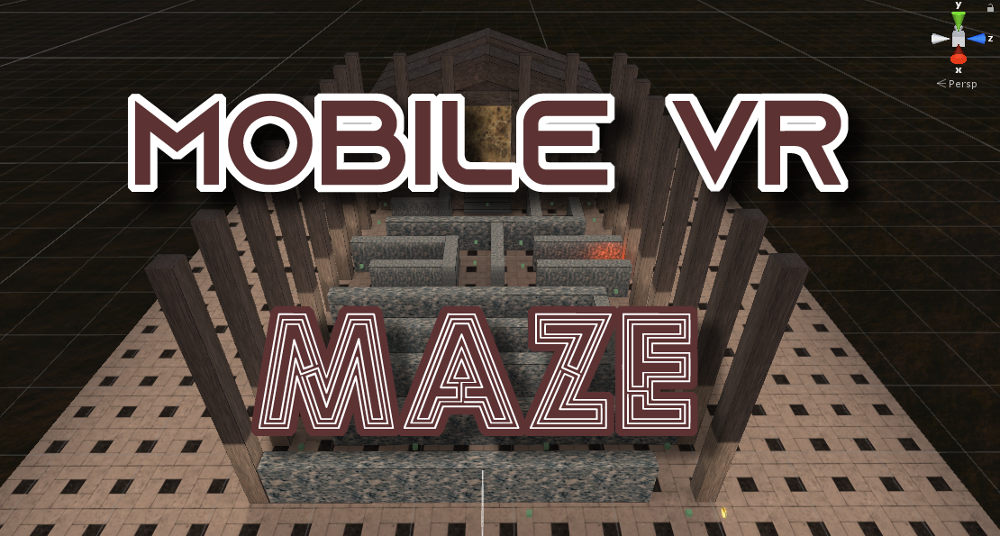
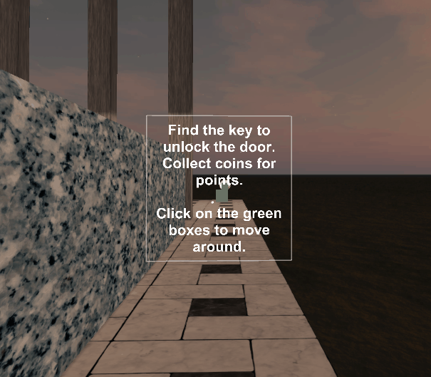
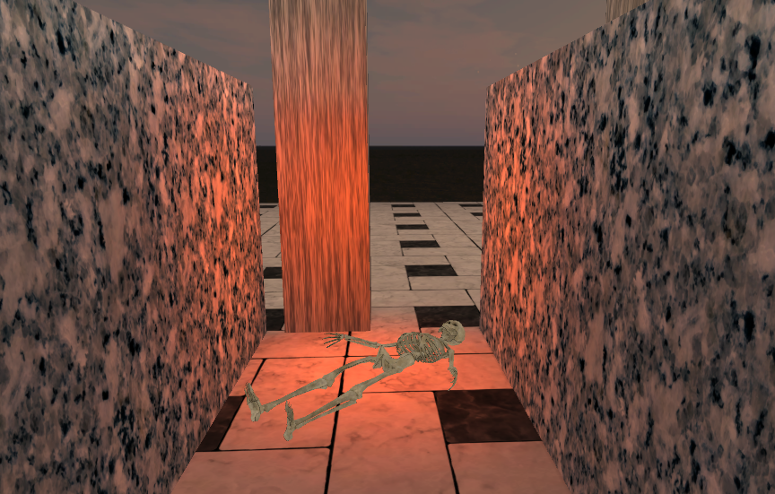
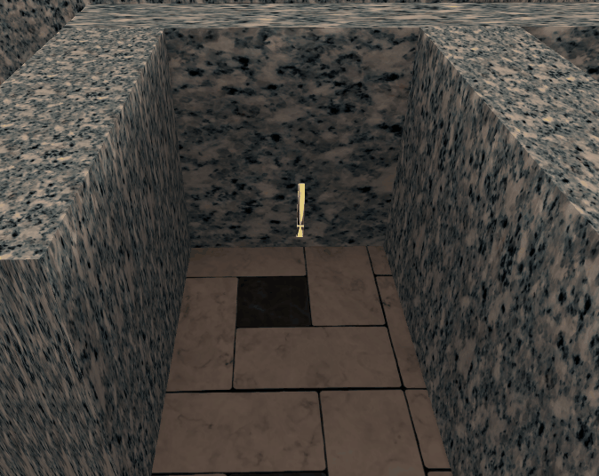
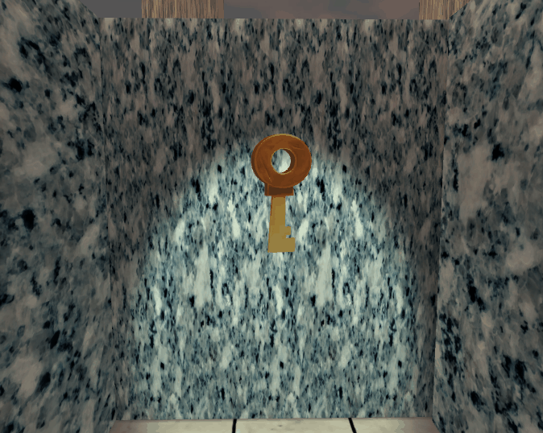

  

This maze was created in the Unity game engine using the GoogleVR SDK. As part of the Udacity VR Nanodeveloper degree, this project explores creating an interactive game which is deployed to a mobile APK to use on an Android phone with a Google cardboard viewer. The player must navigate through the maze and find a key. The door in the end of the maze will open only if the player possesses the key.  

This project has features which include:

## Creating An Environment With Atmosphere

Expanding on previous projects, this project features a maze, which took a few iterations to construct one that is both simple to navigate but has areas where the player must backtrack to find their way. This project includes a skybox to add atmosphere, as well as ambient sounds. The player is greeted with instructions when starting:

  

The player must navigate through the maze and can encounter spooky areas of the maze. Is this a previous player? Is there peril and danger around every corner?

  

## Collectables

The game has 3 coins which can be collected. This was intended to add a layer to the game aside from escaping the maze. The idea here was to incentivize the player to explore the rest of the maze if they so happened to find their way to the key and exit. This part of the game was never fully implemented in that there is no point system or benefit to finding coins. The original idea was to have the maze be timed, and coins give the player more time. 

  

## Interactions and Animations

For this part of the project, the user must find a key before they are able to leave the maze. 

  

The player can get to the end of the maze where they find a door. The door is animated and will only open if the player has the key. Once the player finds the key, the key gameObject will be destroyed. During this process, a "key poof" particle effect will be activated, along with a sound to let the player know they key has been obtained. For the door to activate, there are different ways to go about this. Originally I was going to create a bool which would be set to `True` if the key was obtained, but instead the script to activate the door animation just checks to see if the key gameObject is `NULL`, and if so it will trigger the animation which allows the player to "win" the game.

  

## Next Steps

To continue this project, implementing a timer so the player must complete the maze in a predetermined time and have the coin collectables add time to the clock. The locomotion is not smooth and when user testing the feedback was that there needs to be a transition between waypoints instead of instantaneously jumping to the one selected. This could be accomplished by lerping the main camera from its current position to the position of the waypoint.

## Android Build

To view this project on an Android device, copy the build from the Builds folder onto the phone. Install the build by navigating to the directory you copied it to, and launch the APK file. After the build installs, launch it and it should launch in VR mode. Place the phone into a cardboard viewer (this also works on a Samsung Gear) and place the viewer against your face. To navigate around by waypoints, just look at one and click the button (depending on your viewer). To complete the game you must find the key before you get to the door of the temple to be able to open it.
